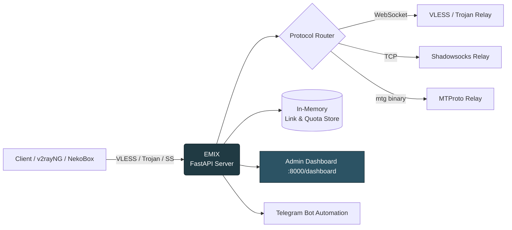
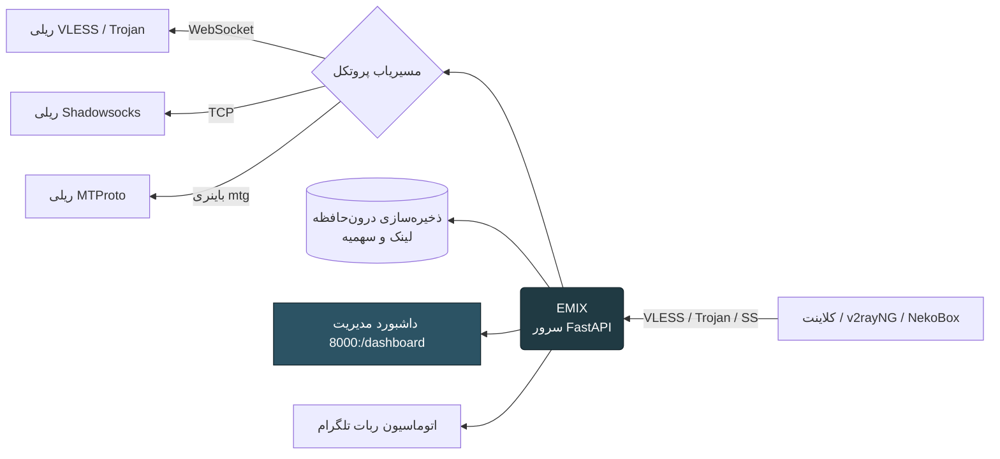

<div align="center">


<a href="#-english"></a>
<a href="#-فارسی"></a>

<br/>


<br/>

[](https://python.org)
[](https://fastapi.tiangolo.com)
[](https://railway.app)
[](./LICENSE)

<br/>

<a href="https://railway.com/new/template?template=https://github.com/EMIXPI/EMIX-PRO">
  
</a>

**⬆️ One-Click Deploy** — Railway auto-configures the port (`PORT`), start command, and healthcheck (`/api/ping`) from `railway.toml`. After deploy, just hit **Settings → Networking → Generate Domain** and open `/dashboard`.


</div>

<br/>

---

<div align="center">
<h1>🇬🇧 EMIX PRO — English</h1>
</div>

## 📖 Table of Contents

- [Overview](#-overview)
- [Features](#-features)
- [Supported Protocols](#-supported-protocols)
- [Architecture](#-architecture)
- [Project Structure](#-project-structure)
- [Quick Start (Railway)](#-quick-start-railway-deploy)
- [Local Development](#-local-development)
- [Environment Variables](#-environment-variables)
- [Dashboard Preview](#-dashboard-preview)
- [Roadmap](#-roadmap)
- [Contributing](#-contributing)
- [License](#-license)
- [Support the Project](#-support-the-project)

<br/>

## 🚀 Overview

**EMIX PRO** is a fast, modern, self-hosted **multi-protocol proxy management panel**, built with **Python + FastAPI**, designed to deploy in minutes on **Railway**.

It gives you a beautiful admin dashboard to create, monitor, and manage proxy links across multiple protocols — with per-link traffic quotas, live connection stats, and QR code generation — all from a single lightweight service.

> 💡 Originally built around a simple VLESS-over-WebSocket relay, EMIX has evolved into a **self-diagnosing network orchestration platform**: what it claims is backed by evidence.

> ✅ **Verification status (v11.1.0-audit):** 642/642 tests green, honest 7-level test classification, full audit trail in [`AUDIT_REPORT_FINAL.md`](./AUDIT_REPORT_FINAL.md), [`PRODUCTION_READINESS_REPORT.md`](./PRODUCTION_READINESS_REPORT.md), [`PROTOCOL_MATRIX_FINAL.md`](./PROTOCOL_MATRIX_FINAL.md), [`TRANSPORT_MATRIX_FINAL.md`](./TRANSPORT_MATRIX_FINAL.md), [`SECURITY_AUDIT_FINAL.md`](./SECURITY_AUDIT_FINAL.md), [`PERFORMANCE_AUDIT_FINAL.md`](./PERFORMANCE_AUDIT_FINAL.md), [`ARCHITECTURE_FINAL.md`](./ARCHITECTURE_FINAL.md), [`MIGRATION_GUIDE_FINAL.md`](./MIGRATION_GUIDE_FINAL.md). This README describes **verified functionality only**.

<br/>

## ✨ Features

<table>
<tr>
<td width="50%">

### 🔌 Core Gateway (verified)
- VLESS over WebSocket (TLS 443) — in-process relay, 0-RTT early-data
- Trojan (SHA224 auth), Shadowsocks AEAD (aes-256-gcm / chacha20)
- XHTTP with 2 uplink modes (packet-up / stream-up), AIMD flow control
- MTProto via the **official MTProxy binary** (compiled, supervised, auto-restart with backoff)
- Internal HTTP Proxy + SOCKS5 (Zeus)
- gRPC = experimental envelope only; HTTPUpgrade = not implemented (honest — see TRANSPORT_MATRIX_FINAL.md)

</td>
<td width="50%">

### 🧠 Network Intelligence (v11 engines)
- **Config Compiler** — self-verifying emission (parse-back + checksum)
- **Network Health Engine** — 10-layer, evidence-only, expiring (UNKNOWN ≠ PASS)
- **Diagnostics Center** — request IDs, structured errors, job telemetry
- **Node Manager + Runtime Supervisor** — heartbeats, crash detection, backoff
- **Smart Route v3** — health-weighted ranking with `ranking_reason`
- **IP Quality Engine** — facet-based, honest UNKNOWNs, provider abstraction

</td>
</tr>
<tr>
<td width="50%">

### 📊 Management Dashboard
- Real-time traffic charts, trend indicators, live connection monitoring
- Unlimited link creation with per-link quotas (MB/GB)
- Instant enable / disable per link
- **Local QR generation** — links/private keys never leave your panel
- Impossible protocol combinations blocked at the UI (compat matrix API)
- Live service status from real diagnostics (no fake widgets)

</td>
<td width="50%">

### 🛡️ Security (tested)
- Session auth + login brute-force guard (5 fails / 15 min / IP)
- SSRF-guarded proxy (private ranges + metadata IP + redirect re-check)
- Atomic state persistence — survives Railway redeploys (sessions included)
- No credential phone-home; no third-party QR; plaintext IP provider off by default
- Backup export/import with validate → stage → rollback → commit

</td>
</tr>
<tr>
<td width="50%">

### 🤖 Automation & Resilience
- 7 bounded background jobs (health sweep, expiry, node heartbeat, runtime supervision, stats, lifecycle reconcile)
- Automated TCP proxy dispatch with blacklist targeting
- Self-healing gaming bridge (VPS down → auto fallback to CF edge)
- One-click Railway deployment

</td>
<td width="50%">

### 🚀 Turbo & Health (real probes)
- Real end-to-end config testing (edge → TLS → auth → target → HTTP reply)
- Per-config ping button + live color-coded badges
- **0-RTT Turbo links** (early-data `ed=2048`) with automatic A/B testing
- Health score 0–100 with documented formula; results expire after 15 min
- Config lifecycle states (CREATED → HEALTHY/DEGRADED → EXPIRED/REVOKED)

</td>
<td width="50%">

### 🌉 Iran Bridge (billing + speed)
- Domestic traffic routing (1x instead of 2.7x)
- Free mode: Iranian CDN (ArvanCloud) — no server needed
- VPS mode: auto-install script (socat + systemd + BBR)
- Real TLS chain test + savings calculator

</td>
</tr>
</table>

<br/>

## 🌐 Supported Protocols

| Protocol | Transport | Status |
|---|---|:---:|
| VLESS | WebSocket / xHTTP (packet-up, stream-up) | ✅ PRODUCTION |
| VLESS | TCP / gRPC | 🟡 EXPERIMENTAL (link emission only) |
| Trojan | WebSocket / xHTTP (packet-up, stream-up) | ✅ PRODUCTION |
| Trojan | TCP | 🟡 EXPERIMENTAL |
| Shadowsocks | WebSocket (AEAD aes-256-gcm / chacha20) | ✅ PRODUCTION |
| MTProto | TCP (official MTProxy binary, supervised) | ✅ PRODUCTION |
| VMess / VLESS-Reality / SS-2022 | link emission | 🟡 BETA (config-gen only) |
| WireGuard / OpenVPN | control-plane (keys, configs, QR) | 🟡 BETA — no runtime on Railway |
| SOCKS5 (Zeus) / HTTP Proxy | in-process | ✅ PRODUCTION |
| Hysteria2 / TUIC / NaiveProxy / SSH | — | ⛔ honestly deferred (refuses to fake) |

Full machine-readable matrix: `GET /api/config-matrix` — one source of truth (compat.py), consumed by backend, frontend and tests. Details: [TRANSPORT_MATRIX_FINAL.md](./TRANSPORT_MATRIX_FINAL.md).

<br/>

## 🏗️ Architecture



<br/>

## 📂 Project Structure

```
EMIX/
├── protocol/                 # Per-protocol relay implementations
├── main.py                   # FastAPI app entrypoint
├── central.py                 # Core orchestration logic
├── pages.py                   # Dashboard route/page handlers
├── updater.py                  # Self-update logic
├── botgeneratedomin.py         # Telegram bot: domain generation
├── bottokentcpproxy.py         # TCP proxy automation via Telegram
├── zeussocks5.py                # SOCKS5 proxy handler
├── requirements.txt
├── .gitignore
└── README.md
```

<br/>

## ⚡ Quick Start (Railway Deploy)

### Option 1 — One-Click (recommended)

[](https://railway.com/new/template?template=https://github.com/EMIXPI/EMIX-PRO)

1. Click the button above — Railway opens with this repo pre-loaded
2. **Deploy** — everything is auto-configured from `railway.toml`:
   - ✅ Port: `PORT` env is set by Railway automatically (app binds `0.0.0.0:$PORT`)
   - ✅ Start command: `python main.py`
   - ✅ Healthcheck: `GET /api/ping` (auto-restart on crash)
3. **Generate Domain**: Railway → Settings → Networking → **Generate Domain** (sets `RAILWAY_PUBLIC_DOMAIN` automatically — the panel shows a reminder toast if you forget)
4. Open `https://your-app.up.railway.app/dashboard` 🎉

### Option 2 — Manual

<table>
<tr>
<td width="60px" align="center">1️⃣</td>
<td>

**Fork this repository**

```
https://github.com/EMIXPI/EMIX-PRO/fork
```

</td>
</tr>
<tr>
<td align="center">2️⃣</td>
<td>

**Deploy on Railway**

1. Go to [Railway.app](https://railway.app)
2. Click **New Project → Deploy from GitHub repo**
3. Select your forked repository
4. Railway auto-builds and deploys 🎉

</td>
</tr>
<tr>
<td align="center">3️⃣</td>
<td>

**Enable a public domain**

Railway → Settings → Networking → **Generate Domain**
(this sets `RAILWAY_PUBLIC_DOMAIN` automatically)

</td>
</tr>
<tr>
<td align="center">4️⃣</td>
<td>

**Open your dashboard**

```
https://your-app.up.railway.app/dashboard
```

Copy the default VLESS link and import it into your client (v2rayNG, NekoBox, Streisand, …).

</td>
</tr>
</table>

<br/>

## 💻 Local Development

```bash
# Clone your fork
git clone https://github.com/EMIXPI/EMIX-PRO.git
cd EMIX

# Create a virtual environment
python -m venv venv
source venv/bin/activate   # Windows: venv\Scripts\activate

# Install dependencies
pip install -r requirements.txt

# Run the server
python main.py
```

The dashboard will be available at `http://localhost:8000/dashboard`.

<br/>

## ⚙️ Environment Variables

| Variable | Description | Default |
|---|---|---|
| `PORT` | Port the service runs on | `8000` |
| `SECRET_KEY` | Internal security key | Randomly generated |
| `RAILWAY_PUBLIC_DOMAIN` | Public Railway domain (auto-set) | `localhost` |

<br/>

## 📸 Dashboard Preview

<div align="center">

> Traffic overview • Live connections • Link manager • QR export


</div>

<br/>

## 🗺️ Roadmap

- [x] Multi-protocol relay (VLESS, Trojan, Shadowsocks, MTProto)
- [x] Telegram bot automation
- [x] Traffic dashboard with charts
- [ ] Persistent storage (Redis / PostgreSQL)
- [ ] Multi-node / cluster support
- [ ] Public REST API for external integrations

<br/>

## 🤝 Contributing

Pull requests are welcome for bug fixes, optimizations, and documentation.
> ⚠️ Please read the [LICENSE](./LICENSE) before contributing — modification and redistribution of modified versions is restricted. Open an issue first if you'd like to discuss a change.

<br/>

## 📄 License

This project is distributed under a **custom license**:
✅ Free to use, deploy, and fork
❌ Modifying and redistributing a modified version is **not permitted**

See the full [LICENSE](./LICENSE) file for details.

<br/>

## ❤️ Support the Project

If this project helped you, consider supporting its development:

<div align="center">

[]([https://your-donate-link.com](https://your-donate-link.com))
[]([https://wallets.example.com](https://your-donate-link.com))

**Made with ❤️ by [EMIX PRO](https://github.com/your-username)**

</div>

<br/>

---

<br/>

<div align="center" dir="rtl">
<h1>🇮🇷 EMIX PRO — فارسی</h1>
</div>

## 📖 فهرست مطالب

- [معرفی](#-معرفی)
- [ویژگی‌ها](#-ویژگیها)
- [پروتکل‌های پشتیبانی‌شده](#-پروتکلهای-پشتیبانیشده)
- [معماری](#-معماری)
- [ساختار پروژه](#-ساختار-پروژه)
- [شروع سریع (دیپلوی روی Railway)](#-شروع-سریع-دیپلوی-روی-railway)
- [توسعه محلی](#-توسعه-محلی)
- [متغیرهای محیطی](#-متغیرهای-محیطی)
- [نقشه راه](#-نقشه-راه)
- [مشارکت](#-مشارکت)
- [لایسنس](#-لایسنس)
- [حمایت از پروژه](#-حمایت-از-پروژه)

<br/>

## 🚀 معرفی

**EMIX PRO** یک پنل مدیریت پروکسی چندپروتکلی، سریع و مدرن است که با **Python + FastAPI** ساخته شده و در چند دقیقه روی **Railway** قابل دیپلوی است.

این پروژه یک داشبورد مدیریتی زیبا در اختیارتان می‌گذارد تا لینک‌های پروکسی را در پروتکل‌های مختلف بسازید، مانیتور کنید و مدیریت کنید — همراه با محدودیت ترافیک اختصاصی برای هر لینک، آمار اتصالات زنده و خروجی QR Code، همه از طریق یک سرویس سبک و یکپارچه.

> 💡 این پروژه که ابتدا یک ریلی ساده VLESS روی WebSocket بود، اکنون به یک دروازه کامل چندپروتکلی با احراز هویت، مدیریت سهمیه و رابط کاربری حرفه‌ای تبدیل شده است.

<br/>

## ✨ ویژگی‌ها

<table dir="rtl">
<tr>
<td width="50%">

### 🔌 هسته دروازه
- VLESS روی WebSocket (TLS 443)
- Trojan، Shadowsocks (AEAD / aes-256-gcm)
- پروکسی MTProto از طریق باینری `mtg`
- HTTP Proxy داخلی
- ترنسپورت‌های xHTTP / gRPC / HTTPUpgrade

</td>
<td width="50%">

### 📊 داشبورد مدیریتی
- نمودار ترافیک لحظه‌ای و شاخص‌های روند
- مانیتورینگ اتصالات زنده
- ساخت لینک نامحدود با محدودیت ترافیک اختصاصی (MB/GB)
- فعال/غیرفعال‌سازی آنی هر لینک
- خروجی QR Code برای هر لینک

</td>
</tr>
<tr>
<td width="50%">

### 🛡️ امنیت و پایداری
- اعتبارسنجی دقیق UUID
- احراز هویت مبتنی بر سشن
- جعل فینگرپرینت TLS (Chrome)
- بافرهای بهینه‌شده ریلی (۵۱۲ کیلوبایت، `TCP_NODELAY`، `SO_KEEPALIVE`)

</td>
<td width="50%">

### 🤖 اتوماسیون
- مدیریت پروکسی یکپارچه با ربات تلگرام
- پیشنهاد دامنه از طریق Cloudflare Worker
- ارسال خودکار پروکسی TCP با هدف‌گیری بلک‌لیست
- دیپلوی با یک کلیک روی Railway

</td>
</tr>
<tr>
<td width="50%">

### 🚀 توربو و سلامت
- تست واقعی end-to-end هر کانفیگ (edge → TLS → احراز هویت → مقصد → پاسخ HTTP)
- دکمه‌ی پینگ برای هر کانفیگ + بج رنگی لحظه‌ای
- **لینک‌های توربو 0-RTT** (early-data با `ed=2048`) + تست A/B خودکار
- «تست همه» با پیشرفت زنده

</td>
<td width="50%">

### 🌉 پل ایران (صورت‌حساب + سرعت)
- مسیر داخلی برای ترافیک (ضریب ۱ به‌جای ۲.۷)
- حالت رایگان: CDN ایرانی (ابَر آروان) — بدون خرید سرور
- حالت VPS: اسکریپت نصب خودکار (socat + systemd + BBR)
- تست واقعی زنجیره TLS + محاسبه‌گر صرفه‌جویی

</td>
</tr>
</table>

<br/>

## 🌐 پروتکل‌های پشتیبانی‌شده

| پروتکل | ترنسپورت | وضعیت |
|---|---|:---:|
| VLESS | WebSocket / xHTTP (دو مود) | ✅ PRODUCTION |
| Trojan | WebSocket / xHTTP (دو مود) | ✅ PRODUCTION |
| Shadowsocks | WebSocket (AEAD) | ✅ PRODUCTION |
| MTProto | TCP (باینری رسمی MTProxy، تحت نظارت) | ✅ PRODUCTION |
| VMess / Reality / SS-2022 | تولید لینک | 🟡 BETA (فقط config-gen) |
| WireGuard / OpenVPN | control-plane (کلید + کانفیگ + QR) | 🟡 BETA — روی Railway ران‌تایم ندارد |
| SOCKS5 / HTTP Proxy | درون-پروسه | ✅ PRODUCTION |
| Hysteria2 / TUIC / NaiveProxy / SSH | — | ⛔ صادقانه deferred (فیک نمی‌سازد) |

ماتریس کامل ماشین‌خوان: `GET /api/config-matrix` — تک‌منبع حقیقت (compat.py).

<br/>

## 🏗️ معماری



<br/>

## 📂 ساختار پروژه

```
EMIX/
├── protocol/                 # پیاده‌سازی ریلی هر پروتکل
├── main.py                   # نقطه ورود اپلیکیشن FastAPI
├── central.py                 # منطق اصلی هماهنگ‌سازی
├── pages.py                   # هندلر مسیرها/صفحات داشبورد
├── updater.py                  # منطق به‌روزرسانی خودکار
├── botgeneratedomin.py         # ربات تلگرام: تولید دامنه
├── bottokentcpproxy.py         # اتوماسیون پروکسی TCP از طریق تلگرام
├── zeussocks5.py                # هندلر پروکسی SOCKS5
├── requirements.txt
├── .gitignore
└── README.md
```

<br/>

## ⚡ شروع سریع (دیپلوی روی Railway)

### روش ۱ — یک‌کلیکی (پیشنهادی) 🚀

[](https://railway.com/new/template?template=https://github.com/EMIXPI/EMIX-PRO)

1. روی دکمه‌ی بالا کلیک کنید — Railway با همین ریپو باز می‌شود
2. **Deploy** بزنید — همه‌چیز از `railway.toml` خودکار تنظیم می‌شود:
   - ✅ پورت: متغیر `PORT` را Railway خودش ست می‌کند (اپ روی `0.0.0.0` گوش می‌دهد)
   - ✅ دستور اجرا: `python main.py`
   - ✅ سلامت‌سنجی: `GET /api/ping` (ری‌استارت خودکار در صورت کرش)
3. **ساخت دامنه**: Railway → Settings → Networking → **Generate Domain** (متغیر `RAILWAY_PUBLIC_DOMAIN` خودکار ست می‌شود — اگر فراموش کنید، خود پنل یادآوری می‌کند)
4. `https://your-app.up.railway.app/dashboard` را باز کنید 🎉

### روش ۲ — دستی

<table dir="rtl">
<tr>
<td width="60px" align="center">1️⃣</td>
<td>

**فورک کردن این ریپازیتوری**

```
https://github.com/EMIXPI/EMIX-PRO/fork
```

</td>
</tr>
<tr>
<td align="center">2️⃣</td>
<td>

**دیپلوی روی Railway**

۱. وارد [Railway.app](https://railway.app) شوید
۲. روی **New Project → Deploy from GitHub repo** کلیک کنید
۳. ریپازیتوری فورک‌شده خود را انتخاب کنید
۴. Railway به‌صورت خودکار پروژه را می‌سازد و دیپلوی می‌کند 🎉

</td>
</tr>
<tr>
<td align="center">3️⃣</td>
<td>

**فعال‌سازی دامنه عمومی**

Railway ← Settings ← Networking ← **Generate Domain**
(این کار متغیر `RAILWAY_PUBLIC_DOMAIN` را خودکار تنظیم می‌کند)

</td>
</tr>
<tr>
<td align="center">4️⃣</td>
<td>

**باز کردن داشبورد**

```
https://your-app.up.railway.app/dashboard
```

لینک پیش‌فرض VLESS را کپی کرده و در کلاینت دلخواه (v2rayNG، NekoBox، Streisand و...) وارد کنید.

</td>
</tr>
</table>

<br/>

## 💻 توسعه محلی

```bash
# کلون کردن فورک شما
git clone https://github.com/EMIXPI/EMIX-PRO.git
cd EMIX

# ساخت محیط مجازی
python -m venv venv
source venv/bin/activate   # ویندوز: venv\Scripts\activate

# نصب وابستگی‌ها
pip install -r requirements.txt

# اجرای سرور
python main.py
```

داشبورد در آدرس `http://localhost:8000/dashboard` در دسترس خواهد بود.

<br/>

## ⚙️ متغیرهای محیطی

| متغیر | توضیح | پیش‌فرض |
|---|---|---|
| `PORT` | پورت اجرای سرویس | `8000` |
| `SECRET_KEY` | کلید امنیتی داخلی | تولید تصادفی |
| `RAILWAY_PUBLIC_DOMAIN` | دامنه عمومی Railway (خودکار) | `localhost` |

<br/>

## 🗺️ نقشه راه

- [x] ریلی چندپروتکلی (VLESS، Trojan، Shadowsocks، MTProto)
- [x] اتوماسیون ربات تلگرام
- [x] داشبورد ترافیک با نمودار
- [ ] ذخیره‌سازی دائمی (Redis / PostgreSQL)
- [ ] پشتیبانی چندنودی / کلاستر
- [ ] API عمومی REST برای یکپارچه‌سازی با سرویس‌های دیگر

<br/>

## 🤝 مشارکت

پول‌ریکوئست برای رفع باگ، بهینه‌سازی و مستندسازی خوش‌آمد است.
> ⚠️ لطفاً قبل از مشارکت، فایل [LICENSE](./LICENSE) را مطالعه کنید — تغییر و بازنشر نسخه تغییریافته محدود شده است. برای هرگونه تغییر، ابتدا یک Issue باز کنید.

<br/>

## 📄 لایسنس

این پروژه تحت یک **لایسنس سفارشی** منتشر شده است:
✅ استفاده، دیپلوی و فورک آزاد
❌ تغییر و بازنشر نسخه تغییریافته **مجاز نیست**

برای جزئیات کامل به فایل [LICENSE](./LICENSE) مراجعه کنید.

<br/>

## ❤️ حمایت از پروژه

اگر این پروژه به شما کمک کرد، می‌توانید از توسعه آن حمایت کنید:

<div align="center">

[]([https://your-donate-link.com](https://your-donate-link.com))
[]([https://wallets.example.com](https://your-donate-link.com))

**ساخته‌شده با ❤️ توسط [EMIX](https://github.com/your-username)**

</div>

<br/>


